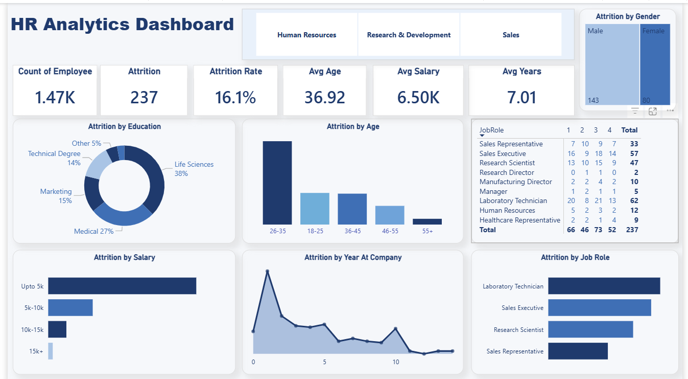

# HR Analytics Dashboard (Interactive Dashboard using Microsoft Power BI)

## Project Objective
The objective of this project is to analyze employee data and provide meaningful HR insights that help organizations understand employee attrition, workforce demographics, job satisfaction, salary distribution, and overall workforce performance. The dashboard enables HR teams to make data-driven decisions for improving employee retention and organizational growth.

## Dataset Used
- HR Analytics Dataset (CSV)

## Questions (KPIs)
- What is the total number of employees?
- What is the overall employee attrition rate?
- What is the average employee age?
- What is the average monthly salary?
- What is the average years at the company?
- Which age group has the highest attrition?
- Which education field has the highest attrition?
- Which salary slab has the highest employee attrition?
- Which job role has the highest attrition?
- How does attrition vary by gender?
- What is the attrition trend based on years at the company?

## Dashboard Interaction
View Interactive Power BI Dashboard

## Process
- Collected and verified the HR dataset for missing values and inconsistencies.
- Cleaned and transformed the data using Power Query.
- Created a data model and established relationships where required.
- Developed DAX measures for KPIs and calculations.
- Designed interactive visualizations using charts, KPI cards, and slicers.
- Built a user-friendly dashboard to analyze employee attrition and workforce trends.

## Dashboard

## Project Insights
- Total Employees: **1,470**
- Employee Attrition: **237**
- Attrition Rate: **16.1%**
- Average Employee Age: **36.92 Years**
- Average Salary: **6.50K**
- Average Years at Company: **7.01 Years**
- Employees aged **26–35 years** have the highest attrition.
- Laboratory Technicians and Sales Executives show the highest attrition among job roles.
- Employees with **Life Sciences** education contribute the highest workforce percentage.
- Most attrition occurs among employees with salaries up to **5K**.

## Tools & Technologies
- Microsoft Power BI
- Power Query
- DAX
- Data Modeling
- Microsoft Excel

## Skills Demonstrated
- Data Cleaning
- Data Transformation
- Data Modeling
- DAX Calculations
- Interactive Dashboard Design
- KPI Development
- Data Visualization
- Business Analysis

## Final Conclusion
The HR Analytics Dashboard helps identify the major factors contributing to employee attrition. By focusing on high-risk employee groups, improving retention strategies for critical job roles, and addressing workforce trends, organizations can reduce employee turnover, improve employee satisfaction, and support better HR decision-making.

